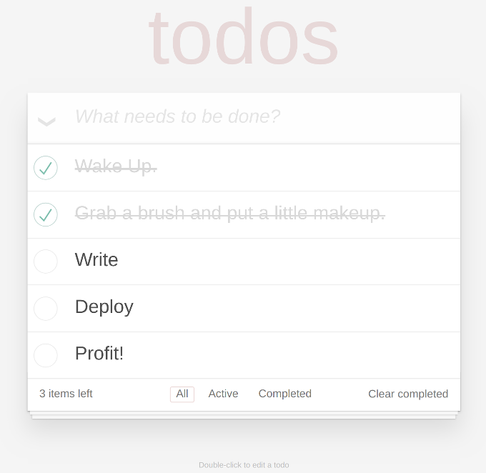

# Code Splitting + SSR + Serverless + DynamoDB with React Router demo

Forked from https://github.com/gdborton/rrv4-ssr-and-code-splitting.

This is a demo repository set up to demo code splitting by route on React Router 
with server rendered React components.

After you fetch server rendered HTML routes start fire __locally__.

## Preparing for demo

Before running the demo, you must install a number of components

  * AWS cli &amp; proper credentials
  * servlerless (`npm install -g serverless`)

Also, either create DynamoDB table manually or execute first time deploy: 

```bash
npm run sls:deploy
```

## Running the demo

```bash
git clone https://github.com/huksley/todo-react-ssr-serverless
cd todo-react-ssr-serverless
npm install
npm run build
AWS_REGION=eu-west-1 npm start
open http://localhost:3000
```

## Running in serverless local

Runs `serverless offline` with webpack support.

```bash
npm run sls
```

## Running in AWS

Creates DynamoDB table, IAM role, deploys Lambda and sets up API Gateway. If custom domain specified, deploys app under this custom domain (first deploy might take some time)

```bash
npm run sls:deploy
```

For proper paths, you __MUST__ define custom domain.

  * Create/transfer domain in/to Route53
  * Verify domain ownership
  * Create *.domain certificate request in CloudFront Global (N. Virginia)
  * Wait for it verifaction

```
CUSTOM_DOMAIN=todo.domain.com CUSTOM_DOMAIN_ENABLED=yes API_URL=https://todo.domain.com/api npm run sls:deploy
```

## Isomorphic!

Thanks to matchRoutes/renderRoutes from `react-router-config` after HTML is received, route state are restored and 
all links start to work client side. 



## Things of note:

 - The contents of this repo were based on the [TodoMVC code](https://github.com/tastejs/todomvc/tree/master/examples/react) originally written by [Pete Hunt](https://github.com/petehunt).
 - Upgraded to webpack v4 comparing to upstream repo
 - We have 3 webpack configs:
   - One for server
   - Another for client
   - Third one (./webpack.serverless.js) for running in serverless
 - The server starts with empty data. Run `curl -X POST http://localhost:3000/api/init` to load initial data.
