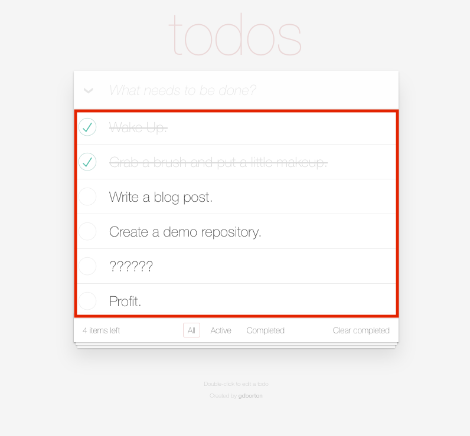

# Code Splitting + SSR with React Router demo

Forked from https://github.com/gdborton/rrv4-ssr-and-code-splitting.

This is a demo repository set up to demo code splitting by route on React Router 
with server rendered React components.

After you fetch server rendered HTML routes start fire __locally__.

## Running the demo:

```
git clone https://github.com/huksley/todo-react-ssr-serverless
cd todo-react-ssr-serverless
npm install
npm start
open http://localhost:3000
```

## Running in serverless local

Runs `serverless offline` with webpack support.

```
npm run sls
```

## What's async loaded?

The list of todos that exists between the input bar and the footer of stack of todos. 
If you open your network tab before navigating between All/Active/Completed, 
you'll notice requests for `0.index.bundle.js`, `1.index.bundle.js`, and `2.index.bundle.js` respectively.



## Things of note:

 - The contents of this repo were based on the [TodoMVC code](https://github.com/tastejs/todomvc/tree/master/examples/react) originally written by [Pete Hunt](https://github.com/petehunt).
 - We're using babel-eslint to enable `import()`.
 - We're using the Airbnb dynamic import plugins, webpack's `import()` creates references to `window` that don't work in node:
   - [babel-plugin-dynamic-import-webpack](https://github.com/airbnb/babel-plugin-dynamic-import-webpack) for client side code.
   - [babel-plugin-dynamic-import-node](https://github.com/airbnb/babel-plugin-dynamic-import-node) for server side code.
 - We have two webpack configs:
   - One for server (`libraryTarget = commonjs2` and `babel-plugin-dynamic-import-node`).
   - Another for client (`babel-plugin-dynamic-import-webpack`).
 - The server, starts with some static data, **and is never updated**, you'll lose your changes if you reload the page.
